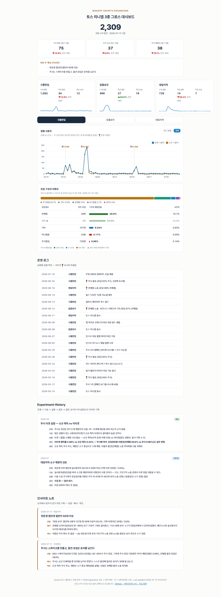

# 토스 미니앱 3종 그로스 대시보드

직접 출시해 운영 중인 토스 미니앱 3종(구름한입 · 잡플로우 · 데일리픽)의 지표를
직접 정의하고, 수집 파이프라인을 만들고, 해석해서 다음 액션으로 연결하기 위해 만든 대시보드입니다.

**Live**: https://app-insight-eight.vercel.app



## 아키텍처

```
[Extract]   토스 콘솔 API 조회 (주 1~2회, 반자동)
   → data/raw/{app}/{metric}-{날짜}.json    원본 보존, 날짜 키 upsert 병합
[Transform] scripts/build_dashboard.py (Python + pandas)
   → data/dashboard.json (웹용) + data/csv/ (Tableau용)
[Serve]     index.html (Chart.js) → git push → Vercel 자동 배포
[Notes]     notes/*.md 관찰 → 해석 → 액션 → 타임라인 렌더
```

## 지표 정의

| 지표 | 정의 |
|---|---|
| 일별 사용자(DAU) | 콘솔 집계 일별 활성 사용자. 가공 없이 원값 |
| 신규 사용자 | 해당 일 첫 방문 사용자. DAU와 겹쳐 그려 재방문 여부를 한눈에 |
| 누적 방문 (헤드라인) | 3앱 DAU 합산. 유니크 유저가 아니므로 '방문'으로 표기 |
| 유입경로별 리텐션 | 콘솔 주간 코호트 원값(비율). 유입경로(전체탭·푸시알림·검색 등)별로 몇 주 뒤에도 남는지 |

## 설계 원칙

- **정직한 데이터**: 수집 누락 구간은 보간 없이 공백으로 표시합니다. raw 스키마가 어긋나면
  빌드가 조용히 0을 채우는 대신 실패합니다(fail-loud). 단위가 불명확한 지표는 확인 전까지
  싣지 않습니다(수집 이력과 제외 사유는 [COLLECT.md](COLLECT.md)).
- **서버 없음**: 반자동 스냅샷 구조에는 정적 호스팅이면 충분합니다. 유지비 0원.
- **하나의 데이터, 두 개의 출구**: 같은 Transform 산출물이 웹(JSON)과 Tableau(CSV)를 모두 먹입니다.
- **숫자보다 해석**: 차트 옆에 관찰 → 해석 → 액션 노트를 함께 둡니다.
  "DAU가 올랐다"가 아니라 "푸시가 만든 스파이크는 남지 않았고, 발견 유입이 30배 잘 남는다"까지.

## 실행

```bash
pip install pandas pytest
python -m pytest                     # 지표 산식·병합·fail-loud 테스트 (23개)
python scripts/build_dashboard.py   # data/raw → dashboard.json + csv
python -m http.server                # 로컬 확인
```

수집 절차와 데이터 계약(envelope)은 [COLLECT.md](COLLECT.md) 참고.

## 앱

| 앱 | 소개 | 출시 |
|---|---|---|
| [구름한입](https://minion.toss.im/9fRSWw66) | 매일 나만의 타로 한 장 | 2026.05 |
| [잡플로우](https://minion.toss.im/DCbu0NX) | 흩어진 취업 지원을 한 곳에서 | 2026.06 |
| 데일리픽 | 면접에서 빛나는 상식 매일 오분 | 2026.06 |
